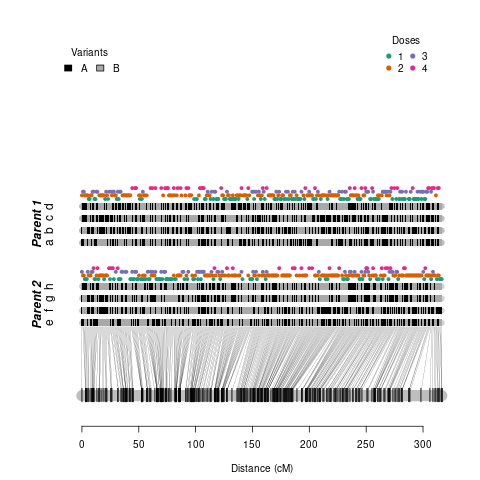

## Why should you use docker images?

* If you do not want to install all software needed for the Polyploid Training Workshop
* You want to run every software via RStudio in your web browser
* You want to use a cluster to run the analysis

All images will run on top of your OS kernel, so they are cross-platform enabled, do not need any configuration, and are ready to go.

## What will you find in this repository?

* [Docker installation instructions](#installing-docker)

* Self-contained images of the following software:

    * [SuperMASSA/VCF2SM]()
    * [polyRAD]()
    * [fitPoly]()
    * [MAPpoly]()
    * [polymapR]()
    * [PolyOrigin]()
    * [QTLpoly]()
    * [polyqtlR]()
    * [diaQTL]()
    * [GWASpoly]()

## Installing Docker

**Linux users:** use the following instructions to [Install Docker on Ubuntu](https://docs.docker.com/engine/install/ubuntu/), or find your distribution [here](https://docs.docker.com/engine/install/).

**Windows users:** download the [Docker Desktop Installer for Windows](https://desktop.docker.com/win/stable/Docker%20Desktop%20Installer.exe) and follow the [Installation instructions for Windows](https://docs.docker.com/docker-for-windows/install/).

**Mac users:** download the [Docker Desktop Installer for Mac](https://desktop.docker.com/mac/stable/Docker.dmg) and follow the [Installation instructions for Mac](https://docs.docker.com/docker-for-mac/install/).

**Cluster users**: most computing clusters already have Docker or Singularity installed - you can jump to the next session, download and run the images. If your cluster does not have any image rendering system, please contact your system administrator. This [information](https://singularity.lbl.gov/install-request) may help you to elaborate a request. 

Docker requires administrator permissions to run. If you do not have these permissions you can use [singularity](https://singularity.lbl.gov/). You can access [here](https://singularity.lbl.gov/docs-docker) some instruction about how to use docker images with singularity.

## Docker useful commands

After installing docker here are some useful commands:

```
# Dowload images and run containers
docker pull                               # Get image from a registry
docker run                                # run a command in a new container
docker run -it -v                         # run in a interactive mode and transferring directory to container environment

# Delete container
docker ps                                 # list all containers available in your computer, search the container you want to delete
docker stop <cointainer_id>               # before delete you should stop it
docker rm <cointainer_id>                 # delete container using the same ID

# Delete image
docker images                             # list all images available in your computer, search the image ID that you want to delete
docker rmi <image_id>                     # delete the image using the same ID

# Delete all images and containers
docker stop $(docker ps -a -q)            # stop all running containers 
docker rm $(docker ps -a -q)              # remove all stopped containers
docker rmi $(docker images -q)            # remove all images
```

## Genotype calling software

* Docker Hub image: [cristaniguti/poly_genocalls](https://hub.docker.com/repository/docker/cristaniguti/poly_genocalls)

### Image contents

* Ubuntu 20.04
* R 4.0.3
* RStudio 1.3
* Python 2.7
* SuperMASSA
* VCF2SM
* polyRAD
* fitPoly

### Running instructions

**Download the container image:** open a terminal and run: `docker pull cristaniguti/poly_genocalls`

Then start the image by running the following commands:

```{bash, eval=FALSE}
# Use VCF2SM
docker run -v $(pwd):/opt cristaniguti/poly_genocalls python /scripts/vcf2sm/VCF2SM.py -i /opt/example.vcf -o /opt/NewPlusOldCalls.headed_poly.vcf -S /scripts/supermassa/src/SuperMASSA.py -I hw -a RA/AA -r 1:84 -d 15 -D 500 -M 4:6 -f 4 -p 0.80 -n 0.90 -c 0.75 -t 1

# Access the RStudio
docker run -p 8787:8787 -v $(pwd):/home/rstudio/ -e DISABLE_AUTH=true cristaniguti/poly_genocalls
```

Keep this terminal open and access `http://localhost:8787/` or `http://127.0.0.1:8787/` in your web browser. Feel free to choose another port different than 8787. You can also run the VCF2SM using the RStudio terminal, but do not forget the path of the scripts inside the container: `/scripts/SuperMASSA.py` and `/scripts/VCF2SM.py`.

**Warning:** container images can be large depending on their content. If you do not plan to use the images soon and want to free up some storage space, please see [Docker useful commands session](#docker-useful-commands) to remove them.

## Linkage Mapping and Haplotype Reconstruction

* Docker Hub image: [cristaniguti/poly_haplo](https://hub.docker.com/repository/docker/cristaniguti/poly_haplo)

### Image contents

* Ubuntu 20.04
* R 4.0.3
* RStudio 1.3
* Julia 1.5.3
* MAPpoly
* polymapR
* PolyOrigin

### Running instructions

**Download the container image:** open a terminal and run: `docker pull cristaniguti/poly_haplo`

Then start the image by running the following commands (feel free to choose another port different than 8787):

```{bash, eval=FALSE}
# Access Julia with
docker run -it -v $(pwd):/opt cristaniguti/poly_haplo /julia-1.5.3/bin/./julia

# Access the RStudio
docker run -p 8787:8787 -v $(pwd):/home/rstudio/ -e DISABLE_AUTH=true cristaniguti/poly_haplo
```

Keep this terminal open and access `http://localhost:8787/` or `http://127.0.0.1:8787/` in your web browser.  You can also run the Julia using the RStudio terminal, but do not forget the path of the script inside the container: `/julia-1.5.3/bin/./julia`. 

With RStudio, try to load any of the included R packages:

```{R, eval=FALSE}
# Loading MAPpoly
library(mappoly)
plot(solcap.err.map[[1]])
```



If you see the same plot shown above, you are ready to go! We recommend that you go ahead and follow each package vignettes and examples on their respective web pages.

**Warning:** container images can be large depending on their content. If you do not plan to use the images soon and want to free up some storage space, please see [Docker useful commands session](#docker-useful-commands) to remove them.

## QTL mapping

* Docker Hub image: [cristaniguti/poly_qtlmap](https://hub.docker.com/repository/docker/cristaniguti/poly_qtlmap)

### Image contents

* Ubuntu 20.04
* R 4.0.3
* RStudio 1.3
* QTLpoly
* diaQTL
* GWASpoly

### Running instructions

**Download the container image:** open a terminal and run: `docker pull cristaniguti/poly_qtlmap`

Then start the image by running the following commands (feel free to choose another port different than 8787):

```{bash, eval=FALSE}
# Access the RStudio
docker run -p 8787:8787 -v $(pwd):/home/rstudio/ -e DISABLE_AUTH=true cristaniguti/poly_qtlmap
```

Keep this terminal open and access `http://localhost:8787/` or `http://127.0.0.1:8787/` in your web browser. Then, try to load any of the included packages:

```{R, eval=FALSE}
# Loading QTLpoly
library(qtlpoly)
load(pheno)
head(pheno)
```

```{R, eval=FALSE}
##              T32        T17        T45
## Ind_1 -0.1698446 -0.9332320 -1.2259338
## Ind_2  2.5319356  0.1997378 -1.8004184
## Ind_3  1.3669074  1.0584794 -0.7980037
## Ind_4  0.7955652 -1.7186921  1.5834176
## Ind_5  1.3168502 -0.7119421  1.3099067
## Ind_6 -0.8778211 -0.2339543 -0.6323779
```

If you see the same output show above, you are ready to go! We recommend that you go ahead and follow each package vignettes and examples on their respective web pages.

**Warning:** container images can be large depending on their content. If you do not plan to use the images soon and want to free up some storage space, please see [Docker useful commands session](#docker-useful-commands) to remove them.

